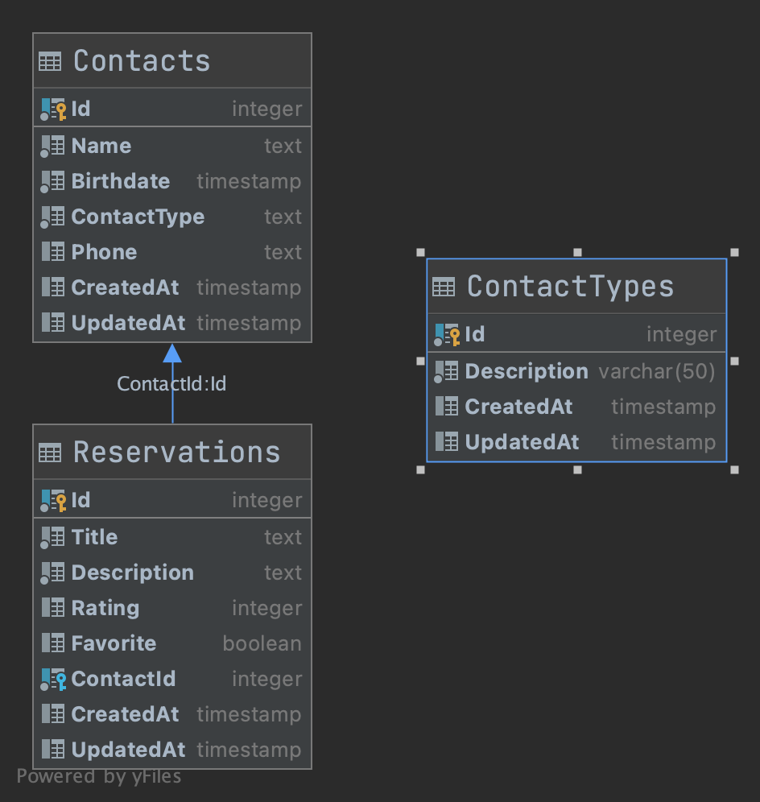

# Migrations

#### Run migrations

Run migrations


#### Schema DB


```sh
$ dotnet ef database update
```

and more info about see [EFCoreMigrations](https://docs.microsoft.com/en-us/ef/core/managing-schemas/migrations/?tabs=dotnet-core-cli)